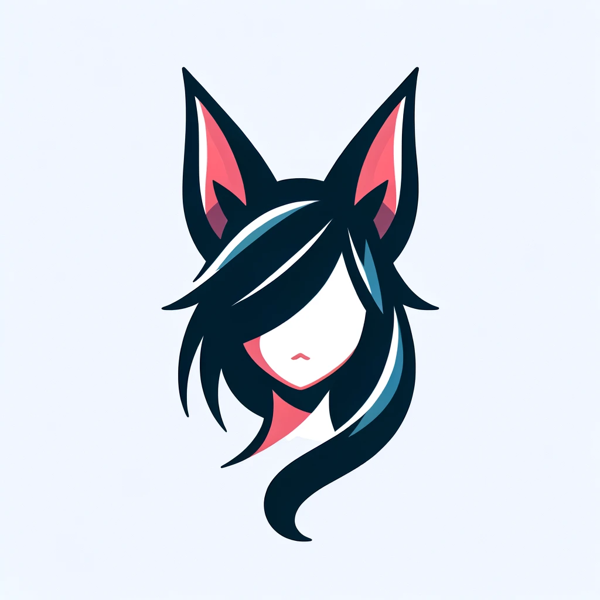

# AhriBot

## Overview

<table>
  <tr>
    <td>
      
    </td>
    <td>
      
AhriBot is a Discord bot based on the League of Legends character Ahri. It offers a variety of features to entertain, inform and manage community members from a Discord server.
          
        AhriBot is a personal project, it is not intended to be hosted by other people. However, you can review the code and suggest features.

    </td>
  </tr>
</table>

## Table of Contents

- [Overview](#overview)
- [Table of Contents](#table-of-contents)
- [Features](#features)
- [Getting Started](#getting-started)
- [Commands](#commands)
  - [Moderation](#moderation)
  - [Members](#members)
  - [Games and entertainment](#games-and-entertainment)
  - [Informations](#informations)
  - [Music](#music)
  - [Member interaction](#member-interaction)
  - [Other](#other)
- [Roadmap](#roadmap) 
- [Technologies Used](#technologies-used)
- [Contribution](#contribution)
- [License](#license)

## Features

- **Moderation**: Ahri will help you moderate your server by automatically deleting messages that contain
  inappropriate content and by banning users who break the rules. She will also give you helpful commands to manage your
  server.
- **Menage members**: Ahri will help you manage your server members by giving them roles and nicknames.
- **Games and entertainment**: Ahri can offer you some minigames and help you organize events.
- **Informations**: Ahri can give you information about League of Legends champions, items and runes.
- **Music**: Ahri can play music for you.
- **And more...**: Ahri can do a lot of other things, but be patient, she is still in development, and learning new things gradually.

## Getting Started

> ⚠️ You can review project code, but please do not selfhost it, since it will not work proprely, due to database and api key
miss.

## Commands
### Moderation

| Command | Description | Usage | implemented |
| --- | --- | --- | --- |
| `/ban` | Ban a user from the server | `/ban <user> <reason> <deletion-days>` | ✅ |
| `/kick` | Kick a user from the server | `/kick <user> <reason>` | ✅ |
| `/mute` | Mute a user | `/mute <user> <duration> <reason>` | ✅ | 
| `/unmute` | Unmute a user | `/unmute <user>` | ✅ |
| `/clear` | Clear a number of messages | `/clear <number>` | ❌ |
| `/moovemessages` | Move messages from one channel to another | `/moovemessages <source-channel> <target-channel> <number>` | ❌ |
| `/setmuterole` | Set the mute role | `/setmuterole <role>` | 🔄 |

### Members

| Command | Description | Usage | implemented |
| --- | --- | --- | --- |
| `/addrole` | Add a role to a user | `/addrole <user> <role>` | ❌ |
| `/removerole` | Remove a role from a user | `/removerole <user> <role>` | ❌ |
| `/setnickname` | Set a nickname to a user | `/setnickname <user> <nickname>` | ❌ |

### Games and entertainment

| Command | Description | Usage | implemented |
| --- | --- | --- | --- |
| `coming soon` | Coming soon | `coming soon` | ❌ |

### Informations

| Command | Description | Usage | implemented |
| --- | --- | --- | --- |
| `/champion` | Get information about a champion | `/champion <champion>` | ❌ |
| `/item` | Get information about an item | `/item <item>` | ❌ |
| `/rune` | Get information about a rune | `/rune <rune>` | ❌ |

### Music

| Command | Description | Usage | implemented |
| --- | --- | --- | --- |
| `/play` | Play a song | `/play <song>` | ❌ |
| `/skip` | Skip the current song | `/skip` | ❌ |
| `/stop` | Stop the current song | `/stop` | ❌ | 
| `/queue` | Display the current queue | `/queue` | ❌ | 
| `/pause` | Pause the current song | `/pause` | ❌ | 
| `/resume` | Resume the current song | `/resume` | ❌ |
| `/volume` | Set the volume | `/volume <volume>` | ❌ |
| `/nowplaying` | Display the current song | `/nowplaying` | ❌ |

### Member interaction

| Command | Description | Usage | implemented |
| --- | --- | --- | --- |
| `/hug` | Hug a user | `/hug <user>` | ❌ |
| `/kiss` | Kiss a user | `/kiss <user>` | ❌ |
| `/pat` | Pat a user | `/pat <user>` | ✅ |
| `/slap` | Slap a user | `/slap <user>` | ❌ |
| `/poke` | Poke a user | `/poke <user>` | ❌ |
| `/cuddle` | Cuddle a user | `/cuddle <user>` | ❌ |
| `/smug` | Smug at a user | `/smug <user>` | ❌ |
| `/tickle` | Tickle a user | `/tickle <user>` | ❌ |
| `/blush` | Blush at a user | `/blush <user>` | ❌ |
| `/bonk` | Bonk a user | `/bonk <user>` | ❌ |
| `/cry` | Cry at a user | `/cry <user>` | ❌ |

### Other

| Command | Description | Usage | implemented |
| --- | --- | --- | --- |
| `/help` | Display the help message | `/help` | 🔄 |
| `/ping` | Display the bot ping | `/ping` | ✅ |
| `/invite` | Display the bot invite link | `/invite` | 🔄 |
| `/stats` | Display the bot stats | `/stats` | ❌ |
| `/quote` | Display a random quote from Ahri | `/quote` | ✅ |

## Roadmap

- [X] Based features
- [ ] Moderation
- [ ] Members
- [ ] Games and entertainment
- [ ] Informations
- [ ] Music
- [ ] Other
- [ ] Documentation
- [ ] Tests

## Technologies Used

- **Kotlin** 
- **JDA** 
- **Spring** 
- **MongoDB** 
- **Docker** 

## Contribution

This project is actually closed to contribution, but you can submit issues or suggest features
by [contacting me](https://github.com/paul-rezzonico#-me-contacter).

## License

Shield: [![CC BY-NC-ND 4.0][cc-by-nc-nd-shield]][cc-by-nc-nd]

This work is licensed under a
[Creative Commons Attribution-NonCommercial-NoDerivs 4.0 International License][cc-by-nc-nd].

[![CC BY-NC-ND 4.0][cc-by-nc-nd-image]][cc-by-nc-nd]

[cc-by-nc-nd]: http://creativecommons.org/licenses/by-nc-nd/4.0/
[cc-by-nc-nd-image]: https://licensebuttons.net/l/by-nc-nd/4.0/88x31.png
[cc-by-nc-nd-shield]: https://img.shields.io/badge/License-CC%20BY--NC--ND%204.0-lightgrey.svg

---

Thank you for you interest in this project, and remember, discord is temporary, but Ahri is forever.

---
